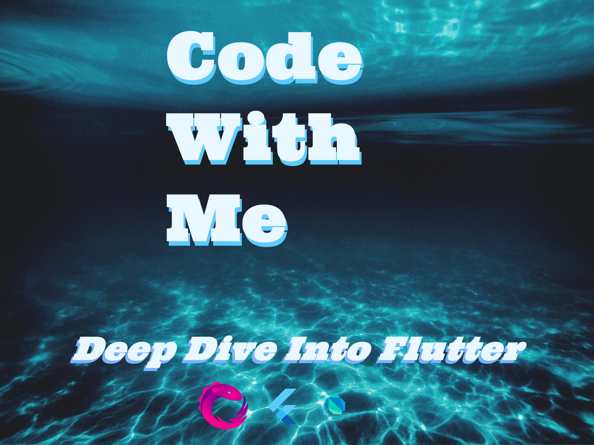

# Code With Me

Like Code Labs but with more polish and more How-Tos from an expert Fluter app designer and developer perspective, as that should have been what Code Labs should be.

As this is a mature front-end app market, so you guys and gals new to Flutter should have a code labs experience that is somewhat both developer and designer high professionally polished.  

## Articles

You can get access to my Medium articles by joining Medium at:

[Medium Join](https://fredgrott.medium.com/membership)

Also note that by following me on medium, you can get free notifications when I publish new articles.

Note that I get a revenue cut of that membership fee which allows me to produce the free stuff, such as the stuff in this repo.

### UIs

[Flutter UI Secret One](https://medium.com/p/flutter-ui-secret-one-acc87c211355)

[Declarative Overlays](https://medium.com/p/declarative-overlays-1c4f744d1c6e)

[Awesome OnBoarding](https://medium.com/p/awesome-onboarding-6b61a1d077ef)

[Google Fonts, The Right Way](https://medium.com/p/google-fonts-the-right-way-72a715f046a3)

### DevOPS

[Easy Mocking With Mocktail](https://medium.com/p/easy-mocking-with-mocktail-f3fd10a1eecd)

[BDD Like Widget Testing](https://medium.com/p/bdd-like-widget-testing-bb95b12edac7)

[Expert Way To Use Goldens](https://medium.com/p/expert-way-to-use-goldens-45b46aa8e2c3)

[An Opinionated Way To Install The Flutter SDK](https://medium.com/p/an-opinionated-way-to-install-the-flutter-sdk-cca997967192)

[Easy UML Generation](https://medium.com/p/easy-uml-generation-e6e16e5c8b0a)

[Super Secret Bug Trap For Flutter](https://medium.com/geekculture/super-secret-bug-trap-for-flutter-c89d36974b96)

[My Expert Project SetUp, Layered Onion Architecture](https://medium.com/geekculture/my-expert-project-setup-layered-onion-architecture-5dd06e29ee9f)

[Flutter Perfect SetUp](https://medium.com/codex/flutter-perfect-setup-c5462b412f78)

[Flutter Expert IDE SetUp](https://medium.com/geekculture/flutter-expert-ide-set-up-25791ce690c)

[Expert Catcher SetUp For Flutter Apps](https://medium.com/p/expert-catcher-setup-for-flutter-apps-a9ee3a6a9e08)

### OOP and FP

[Clean Arch For Flutter Designers](https://medium.com/p/clean-arch-for-flutter-designers-b8076416d2ca)

[What The Hell Is State Management](https://medium.com/p/what-the-hell-is-state-management-ee49559e6f48)

[AntiPatterns Of State](https://medium.com/p/anitpatterns-of-state-610dae657ac6)

[Training Wheels For Reactive Flutter](https://medium.com/p/training-wheels-for-reactive-flutter-d1ae35c47787)

[Deep Dive Into State](https://medium.com/geekculture/deep-dive-into-state-34b443da3573)

[Choosing A Flutter State Management Solution](https://medium.com/p/choosing-a-flutter-state-management-solution-cccf1b2acf10)

## About Fred Grott

Reformed ADHD'er and Android native app developer. You can DM at my key base profile:

[Keybase Profile](https://keybase.io/fredgrott)
